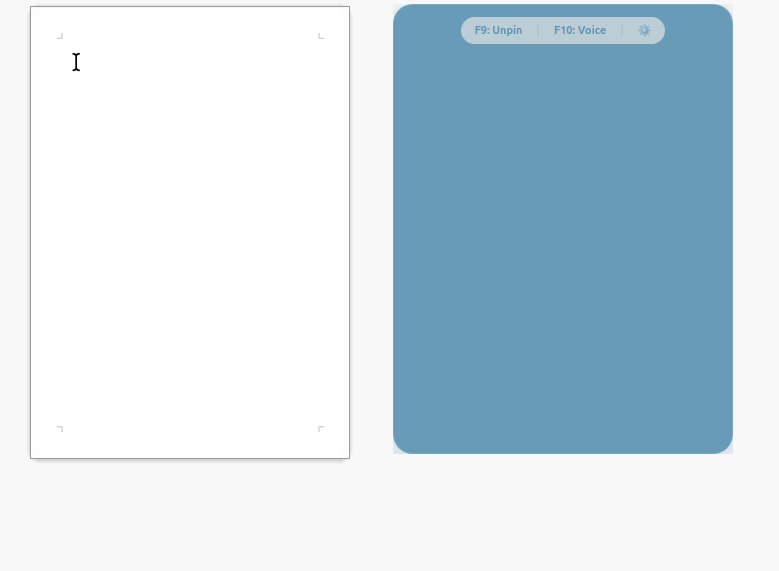

<div align="center">


# LinuxWhisper

**A Voice-Assistant & AI Companion for Linux**

[](https://www.python.org/)
[](LICENSE)
[](https://groq.com)

---

**LinuxWhisper** is a simple voice assistant designed to help you with daily tasks. It uses global hotkeys to provide AI-powered tools without switching windows.

<br />



</div>

## Features

- ✨ **Aria**: Unified AI Assistant for Dictation, Chat, Rewrite, and Vision.
- 🎙️ **Dictation**: Voice-to-text with context awareness.
- 👁️ **Vision**: Intelligent screen analysis using **Llama 4**.
- 🔊 **Voice Feedback**: Optional text-to-speech for AI responses.
- 🎨 **Customizable UI**: Multiple premium color schemes (e.g., Oceanic Zen, Neon Nightshade) and scalable chat overlay.
- ⚙️ **System Tray**: Manage history, toggle overlay visibility ("Hide Chat Overlay"), and access settings quickly.

---

## ⌨️ Command Center

| Key | Action | Purpose |
|:---:|:---|:---|
| `F3` | **Aria** | Unified Assistant (Speak to Dictate, Ask, Rewrite, or Analyze Screen) |
| `F9` | **Pin** | Toggle "Always on Top" for chat |
| `F10` | **TTS** | Toggle AI voice feedback |

---

## 🛠️ Quick Start

### 1. Requirements
*   **Linux** (Ubuntu/Debian recommended)
*   **Groq API Key**: [Get your free key here](https://console.groq.com)

### 2. Installation
```bash
git clone https://github.com/Dianjeol/LinuxWhisper.git && cd LinuxWhisper
./setup.sh
```

### 3. Launch
```bash
# Set your API Key once
export GROQ_API_KEY="your_key"

# Start the whisperer
linuxwhisper

# Or alternatively:
python -m linuxwhisper
```

> [!TIP]
> Use the **System Tray** icon or the ⚙️ icon in the chat overlay to adjust TTS voices and preferences.

---


## 📂 Project Structure

```
src/linuxwhisper/
├── __init__.py          # Package version
├── __main__.py          # python -m linuxwhisper
├── app.py               # main() entry point
├── config.py            # Config dataclass + CFG singleton
├── state.py             # AppState + SettingsManager + STATE
├── api.py               # Groq client initialization
├── decorators.py        # safe_execute, run_on_main_thread
├── services/
│   ├── audio.py         # AudioService (recording + transcription)
│   ├── ai.py            # AIService (chat + vision)
│   ├── tts.py           # TTSService (Orpheus voice)
│   ├── clipboard.py     # ClipboardService (xdotool + pyperclip)
│   └── image.py         # ImageService (screenshots)
├── managers/
│   ├── history.py       # HistoryManager (conversation + tray history)
│   ├── chat.py          # ChatManager (overlay state + auto-hide)
│   └── overlay.py       # OverlayManager (recording indicator)
├── ui/
│   ├── recording_overlay.py  # GtkOverlay (waveform visualization)
│   ├── chat_overlay.py       # ChatOverlay (WebKit2 + HTML/CSS/JS)
│   ├── settings_dialog.py    # SettingsDialog (voice, schemes, hotkeys)
│   └── tray.py               # TrayManager (AppIndicator)
├── handlers/
│   ├── mode.py           # ModeHandler (dictation/AI/rewrite/vision)
│   └── keyboard.py       # KeyboardHandler (pynput listener)
├── debug_keys.py         # Utility to find keyboard keycodes
└── fix_install.sh        # Utility to fix dependency/audio issues
```
