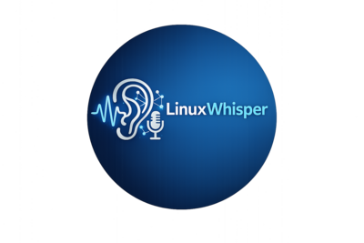

<div align="center">



# LinuxWhisper

**The Premium Voice-AI Companion for your Linux Desktop**

[](https://www.python.org/)
[](LICENSE)
[](https://groq.com)

---

**LinuxWhisper** is a high-performance, context-aware voice assistant seamlessly integrated into your workflow. Perform complex AI tasks with simple global hotkeys—no context switching required.

</div>

## ✨ Features

- 🎙️ **Dictation**: Instant speech-to-text at your cursor using **Whisper-v3**.
- 💬 **AI Chat**: Contextual Q&A with deep integration.
- ✍️ **Smart Rewrite**: Transform selected text using voice commands.
- 👁️ **Vision**: Analyze screenshots instantly with **Llama 4**.
- 🔊 **Voice Feedback**: High-quality TTS for natural AI interaction.

---

## ⌨️ Command Center

| Key | Action | Purpose |
|:---:|:---|:---|
| `F3` | **Dictate** | Transcribe voice to text at cursor |
| `F4` | **Chat** | Open/Focus AI conversation |
| `F7` | **Rewrite** | Highlight text → Speak to modify |
| `F8` | **Vision** | Screenshot + Intelligent Analysis |
| `F9` | **Pin** | Toggle "Always on Top" for chat |
| `F10` | **TTS** | Toggle AI voice feedback |

---

## 🛠️ Quick Start

### 1. Requirements
*   **Linux** (Ubuntu/Debian recommended)
*   **Groq API Key**: [Get it here](https://console.groq.com)

### 2. Installation
```bash
git clone https://github.com/Dianjeol/LinuxWhisper.git && cd LinuxWhisper
./setup.sh
```

### 3. Launch
```bash
# Set your API Key once
export GROQ_API_KEY="your_key"

# Start the whisperer
./venv/bin/python linuxwhisper.py
```

> [!TIP]
> Use the **System Tray** icon or the ⚙️ icon in the chat overlay to adjust TTS voices and preferences.

---

<p align="center">
  Built with ❤️ for the Linux Community
</p>

